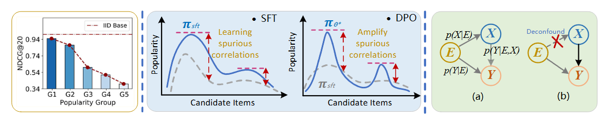

# Causal Direct Preference Optimization for Distributionally Robust Generative Recommendation

<p align="center">

</p>

This method introduces a backdoor  adjustment strategy during the preference alignment phase to eliminate interfer-
ence from environmental confounders, explicitly models the latent environmental
distribution using a soft clustering approach, and enhances robust consistency
across diverse environments through invariance constraints. Theoretical analy-
sis demonstrates that CausalDPO can effectively capture users’ stable preference
structures across multiple environments, thereby improving the OOD generaliza-
tion performance of LLM-based recommendation models. We conduct extensive
experiments under four representative distribution shift settings to validate the
effectiveness of CausalDPO, achieving an average performance improvement of
24.10% across four evaluation metrics.

##  📝 Environment

1.  Create an environment named llm_gpu
    ```bash
    conda create --name llm_gpu python=3.10 
    ```
2. Install packages from requirements.txt
    ```bash
    pip install -r requirements.txt 
    ```

## 📈 Dataset
We conducted extensive experiments on the following three datasets. Detailed data processing procedures can be found in Appendix C.1 of our paper.

| Dataset        | Movielens-10M | Yelp2018  | Book-Crossing |
|----------------|----------------|-----------|----------------|
| #Sequence      | 71,567         | 31,668    | 278,858        |
| #Items         | 10,681         | 38,048    | 271,379        |
| #Interactions  | 10,000,054     | 1,561,406 | 1,149,780      |


## 🔬 Model Framework
Our model architecture comprises three core modules: supervised fine-tuning (SFT), CausalDPO-based preference alignment, and inference/evaluation
```
project-root/
├── dataset/
├── eval_result/
├── llm/
├── prompt/
├── save_checkpoint/
├── trainer/
│ ├── causal_dpo.py
│ ├── causal_dpo.sh
│ ├── eval.sh
│ ├── evaluate.py  
│ ├── framework.png
│ ├── inference.py
│ ├── inference.sh
│ ├── README.md
│ ├── requirements.txt
│ ├── sft.py
│ ├── sft.sh
│ └── text_to_embeddings.py
```
##  🚀 Quick Reproduction
Under resource-constrained conditions, you may choose to load our pre-trained weights to quickly reproduce the results in the paper. The specific operational steps are as follows:
1. Download Llama-3.1-8B-Instruct and paraphrase-MiniLM-L3-v2 from HuggingFace into their respective directories under the 'llm' folder.
```
├── llm/
  --Lama3-8b
  --paraphrase-MiniLM-L3-V2
```
2. Download the fine-tuned CausalDPO weights from our provided link.
```
├── save_checkpoint/
    ├──  ml-10m
      --save_path_cdpo
```
3. Execute inference.sh and eval.sh respectively to perform model inference and evaluation.
```
bash inference.sh
```
```
bash eval.sh
```

## 🙏 Acknowledgments 

We extend our special gratitude to the authors of the [S-DPO](https://github.com/chenyuxin1999/S-DPO) and [SPRec](https://github.com/RegionCh/SPRec?tab=readme-ov-file) methods, whose implementations and codebase informed our model architecture and evaluation methodology. Proper citations have been included in our paper.

